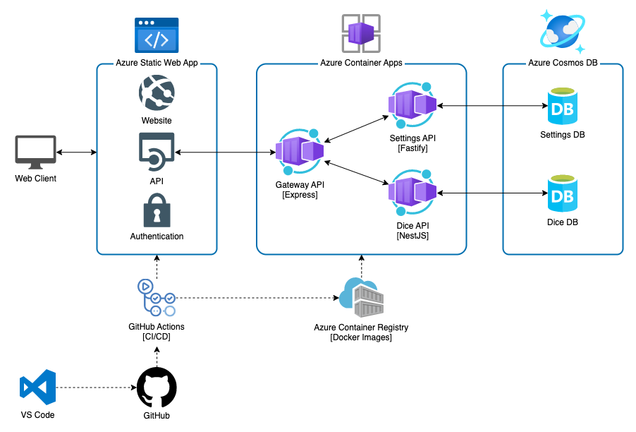

# azure-nodejs-microservices

## Prerequisites

- Node.js 18+
- Docker

## Architecture

<!-- can be edited with https://draw.io -->


## How to run locally

```bash
npm install
npm start
```

## How to build Docker images

```bash
npm run docker:build
```

## How to setup deployment

```bash
./azure/setup.sh
```
