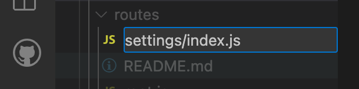
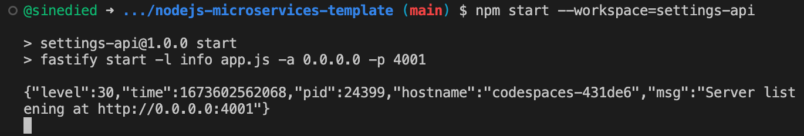
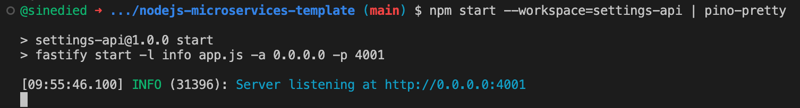
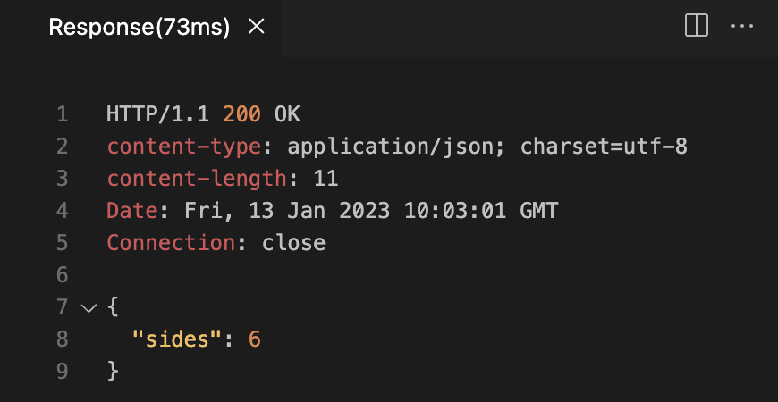
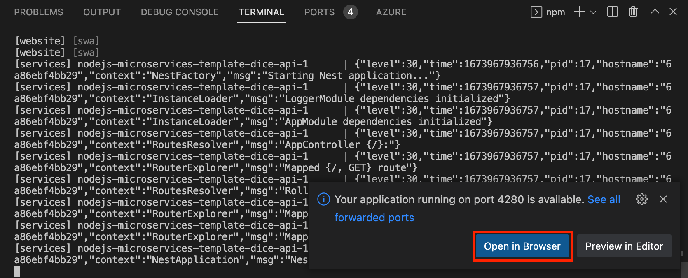
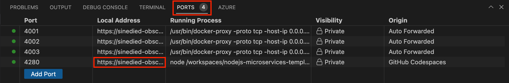
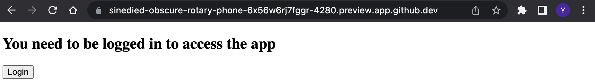
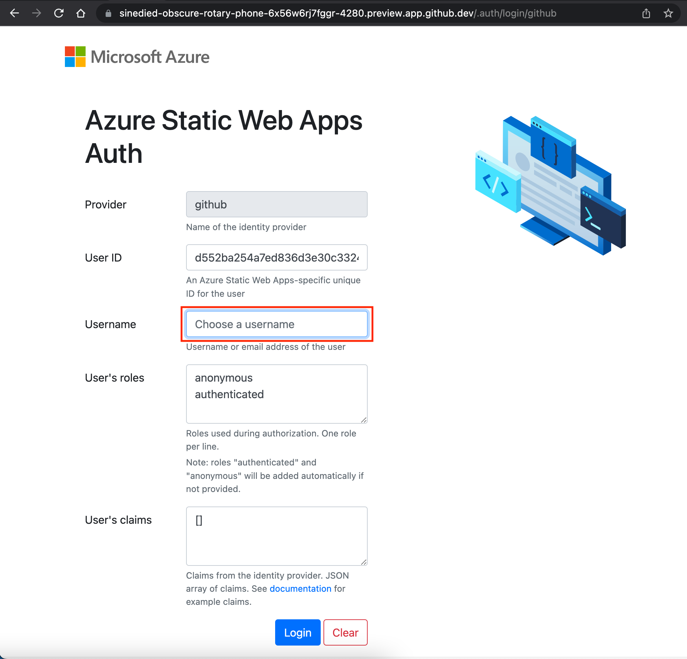
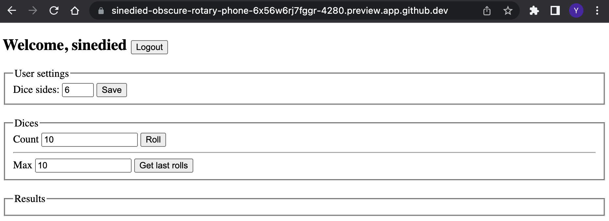

# Microservices in practice with Node.js, Docker and Azure

In this workshop, we'll explore the fundamentals of microservices architecture and how to implement it from code to production, using Node.js, Docker and Azure.

We will build a complete application including a website with authentication and 3 microservices, deploy it to Azure using a CI/CD pipeline, perform load testing to tune the scaling of our services, and use log tracing and monitoring. And we'll do all that without needing to use Kubernetes!

## Goals and topics covered
- Brief review of microservices architecture and its benefits
- Create Node.js services using 3 differents frameworks
  * NestJS
  * Fastify
  * Express
- Containerize services with Docker
- Use Docker multi-stage builds
- Connect services to their database
- Setup a CI/CD pipeline with GitHub Actions
- Deploy services to Azure Container Apps
- Load testing and scaling
- Log tracing and monitoring

## Prerequisites

| | |
|----------------------|------------------------------------------------------|
| GitHub account       | [Get a free GitHub account](https://github.com/join) |
| Azure account        | [Get a free Azure account](https://azure.microsoft.com/free) |
| A web browser        | [Get Microsoft Edge](https://www.microsoft.com/edge) |
| JavaScript knowledge | [JavaScript tutorial on MDN documentation](https://developer.mozilla.org/docs/Web/JavaScript)<br>[JavaScript for Beginners on YouTube](https://www.youtube.com/playlist?list=PLlrxD0HtieHhW0NCG7M536uHGOtJ95Ut2) |

We'll use [GitHub Codespaces](https://github.com/features/codespaces) to have an instant dev environment already prepared for this workshop.

If you prefer to work locally, we'll also provide instructions to setup a local dev environment using either VS Code with a [dev container](https://aka.ms/vscode/ext/devcontainer) or a manual install of the needed tools.

---

## Introduction

In this workshop we'll build a simple dice rolling application, with a website and 3 containerized microservices. The focus will be on the microservices: how to build them using different Node.js frameworks, connect them to their database, and deploy them to Azure. We'll also see how to setup a CI/CD pipeline to deploy our services using Infrastructure as Code (IaC), and how to monitor, debug and scale them.

We'll cover a lot of differents topics and concepts here, but don't worry, we'll take it step by step. 

<div class="info" data-title="note">

> This workshop is designed to be modular: when indicated, some of the parts can be skipped so that you can focus on the topics that interest you the most.

</div>

### Application architecture

Here's the architecture of the application we'll build in this workshop:


Our application is split into 4 main components:

1. **A website**, built with plain HTML/JavaScript using [Vite](https://vitejs.dev/) and hosted on [Azure Static Web Apps](https://azure.microsoft.com/services/app-service/static/). This website will allow users to login with GitHub, save their preferences and roll dices.

2. **A settings service**, built with [Fastify](https://www.fastify.io/) and hosted on [Azure Container Apps](https://azure.microsoft.com/services/app-service/containers/), using [Azure Cosmos DB](https://azure.microsoft.com/services/cosmos-db/) for its database. This internal API will allow users to save and retrieve their preferences.

3. **A dice rolls service**, built with [NestJS](https://nestjs.com/) and hosted on [Azure Container Apps](https://azure.microsoft.com/services/app-service/containers/), , using [Azure Cosmos DB](https://azure.microsoft.com/services/cosmos-db/) for its database. This internal API will allow users to roll dices and get an history of the last rolls.

4. **A gateway service**, built with [Express](https://expressjs.com/) and hosted on [Azure Container Apps](https://azure.microsoft.com/services/app-service/containers/). This publicly exposed API will act as a proxy between the website and the other APIs, and will check user authentication.

The user authentication will be provided by [Azure Static Web Apps](https://azure.microsoft.com/services/app-service/static/), which will also host our website. It will rely on [GitHub OAuth](https://docs.github.com/en/developers/apps/building-oauth-apps/authorizing-oauth-apps) as an identity provider.

### Why microservices?

Microservices architecture is a way to build applications by splitting them into small, independent services. Each service is responsible for a specific part of the application, and can be developed, deployed and scaled independently.

Microservices have many benefits:
- **Scalability**: each service can be scaled independently, and can be scaled up or down depending on the load.
- **Resilience**: if one service fails, the others will still be available.
- **Maintainability**: each service can be developed and deployed independently, by different teams, and can be replaced by another service if needed.
- **Flexibility**: each service can be developed with a different technology, and can be replaced by another service if needed.

But there are also some challenges:
- **Complexity**: microservices architecture is more complex than a monolithic application, and requires more infrastructure and tooling.
- **Communication**: services need to communicate with each other, and this can be induce latency and network issues.
- **Debugging**: when a service fails, it can be hard to find the root cause.
- **Monitoring**: it can be difficult to monitor the health of all the services, and detect issues.

We'll see how to address these challenges in this workshop.

---

## Preparation

Before starting the development, we'll need to setup our project and development environment. This includes:

- Creating a new project on GitHub based on a template
- Using a prepared dev container environment on either [GitHub Codespaces](https://github.com/features/codespaces) or [VS Code with Dev Containers extension](https://aka.ms/vscode/ext/devcontainer) (or a manual install of the needed tools)

### Creating the project

Open [this GitHub repository](https://github.com/azure-samples/nodejs-microservices-template), select the **Fork** button and click on **Create fork** to create a copy of the project in your own GitHub account.


Once the fork is created, select the **Code** button, then the **Codespaces** tab and click on **Create Codespaces on main**.


This will start the creation of a dev container environment, which is a pre-configured container with all the needed tools installed. Once it's ready, you have everything you need to start coding. It even ran `npm install` for you!

<div class="info" data-title="note">

> Codespaces includes up to 60 hours of free usage per month for all GitHub users, see [the pricing details here](https://github.com/features/codespaces).

</div>

#### [optional] Working locally with the dev container

If you prefer to work locally, you can also run the dev container on your machine. If you're fine with using Codespaces, you can skip directly to the next section.

To work on the project locally using a dev container, first you'll need to install [Docker](https://www.docker.com/products/docker-desktop) and [VS Code](https://code.visualstudio.com/), then install the [Dev Containers](https://aka.ms/vscode/ext/devcontainer) extension.

<div class="tip" data-title="tip">

> You can learn more about Dev Containers in [this video series](https://learn.microsoft.com/shows/beginners-series-to-dev-containers/).
[Check the website](https://containers.dev) and [the specification](https://github.com/devcontainers/spec) if you want to learn more about Dev Containers.

</div>

After that you need to clone the project on your machine:

1. Select the **Code** button, then the **Local** tab and copy your repository url.


2. Open a terminal and run:

```bash
git clone <your_repo_url>
```

3. Open the project in VS Code, open the **command palette** with `Ctrl+Shift+P` (`Command+Shift+P` on macOS) and enter **Reopen in Container**.


The first time it will take some time to download and setup the container image, meanwhile you can go ahead and read the next sections.

Once the container is ready, you will see "Dev Container: Node.js" in the bottom left corner of VSCode:


#### [optional] Working locally without the dev container

If you want to work locally without using a dev container, you'll need to clone the project and install the following tools:

| | |
|---------------|--------------------------------|
| Git           | [Get Git](https://git-scm.com) |
| Docker v20+   | [Get Docker](https://docs.docker.com/get-docker) |
| Node.js v18+  | [Get Node.js](https://nodejs.org) |
| Azure CLI     | [Get Azure CLI](https://learn.microsoft.com/cli/azure/install-azure-cli#install) |
| GitHub CLI    | [Get GitHub CLI](https://cli.github.com/manual/installation) |
| Azure Static Web Apps CLI | [Get Azure Static Web Apps CLI](https://github.com/Azure/static-web-apps-cli#installing-the-cli-with-npm-yarn-or-pnpm) |
| pino-pretty log formatter | [Get pino-pretty](https://github.com/pinojs/pino-pretty#install) |
| Bash v3+      | [Get bash](https://www.gnu.org/software/bash/) (Windows users can use **Git bash** that comes with Git) |
| Perl v5+      | [Get Perl](https://www.perl.org/get.html) |
| jq            | [Get jq](https://stedolan.github.io/jq/download) |
| A code editor | [Get VS Code](https://aka.ms/get-vscode) |

You can test your setup by opening a terminal and typing:

```sh
git --version
docker --version
node --version
az --version
gh --version
swa --version
bash --version
perl --version
jq --version
```

---

## Overview of the project

The project template you forked is a monorepo, a single repository containing multiple projects. It's organized as follows (for the most important files):

```sh
.azure/           # Azure infrastructure templates and scripts
.devcontainer/    # Dev container configuration
packages/         # The different services of our app
|- gateway-api/   # The API gateway, created with generator-express
|- settings-api/  # The settings API, created with Fastify CLI
|- dice-api/      # The dice API, created with NestJS CLI
+- website/       # The website, created with Vite CLI
api.http          # HTTP requests to test our APIs
package.json      # NPM workspace configuration
```

As we'll be using Node.js to build our APIs and website, we had setup a [NPM workspace](https://docs.npmjs.com/cli/using-npm/workspaces) to manage the dependencies of all the projects in a single place. This means that when you run `npm install` in the root of the project, it will install all the dependencies of all the projects and make it easier to work in a monorepo.

For example, you can run `npm run <script_name> --workspaces` in the root of the project to run a script in all the projects, or `npm run <script_name> --workspace=packages/gateway-api` to run a script for a specific project. 

Otherwise, you can use your regular `npm` commands in any project folder and it will work as usual.

### About the services

We generated the base code of our differents services with the respective CLI or generator of the frameworks we'll be using, with very few modifications made so we can start working quickly on the most important parts of the workshop.

The only changes we made to the generated code is to remove the files we don't need, configure the ports for each API, and setup [pino-http](https://github.com/pinojs/pino-http) as the logger to have a consistent logging format across all the services.

<div class="info" data-title="note">

> If you want to see how the services were generated and the details of the changes we made, you can look at [this script](https://github.com/Azure-Samples/nodejs-microservices/blob/main/scripts/create-projects.sh) we used to generate the projects.

</div>

---

<div class="info" data-title="skip notice">

> If you want to skip the Settings API implementation and jump directly to the next section, run this command in the terminal to get the completed code directly: `TODO`

</div>

## Settings API

We'll start by creating the Settings API, which will be responsible for storing the settings of each user. 

It will be a simple API with two endpoints:
- `PUT /settings/{user_id}`: update settings of a user
- `GET /settings/{user_id}`: retrieve settings of a user

The settings data we'll store for each user will be the number of sides of the dice they want to use, using the following format:

```json
{
  "sides": 6
}
```

### Introducing Fastify

We'll be using [Fastify](https://www.fastify.io/) to create our Settings API. Fastify is a web framework highly focused on providing the best developer experience with the least overhead and a powerful plugin architecture.

It's very similar to Express, but it's much faster and more lightweight making it a good choice for microservices. It also comes with first-class TypeScript support, though we'll be using here the default JavaScript template.

### Creating the database plugin

To store the settings of each user, we'll need at some point a database. For now, we'll start by using a mock with an in-memory database, and we'll add the proper connection later when our database will be deployed.

Let's start by creating a plugin for Fastify to make it easy to use in our API.

Create a new file `packages/settings-api/plugins/database.js` with the following content:

```js
import fp from 'fastify-plugin'

// the use of fastify-plugin is required to be able
// to export the decorators to the outer scope

export default fp(async function (fastify, opts) {
  fastify.decorate('db', new MockDatabase());
});
```

Plugins in Fastify are just functions that receive the Fastify instance and the options passed to the plugin. All plugins within the `plugins/` folder will be automatically loaded by Fastify when the server starts.

Using the `decorate` method, we can add properties to the Fastify instance, which will be available in all the routes of our API. It's a form of [dependency injection](https://en.wikipedia.org/wiki/Dependency_injection). We use it here to provide a `db` property that will be an instance of our database service.

Now we'll implement the `MockDatabase` class. Add this code at the bottom of the file:

```js
class MockDatabase {
  constructor() {
    this.db = {};
  }

  async saveSettings(userId, settings) {
    await this.#delay();
    this.db[userId] = settings;
  }
  
  async getSettings(userId) {
    await this.#delay();
    return this.db[userId];
  }

  async #delay() {
    return new Promise(resolve => setTimeout(resolve, 10));
  }
}
```

<div class="tip" data-title="tip">

> We are using the **async/await** keywords to allow asynchronous, promise-based behavior to be written like regular synchronous code. You can read more about it in the [MDN documentation](https://developer.mozilla.org/docs/Learn/JavaScript/Asynchronous/Promises#async_and_await).

</div>

As you can see, we are using a simple object to store the settings of each user. We are also adding a delay of 10ms to simulate the latency of a real database call.

<div class="tip" data-title="tip">

> Did you noticed the `#` before the `#delay()` method? This new feature of JavaScript means that this method is private, and only class members are allowed to call it. You can read more about it in the [MDN documentation](https://developer.mozilla.org/docs/Web/JavaScript/Reference/Classes/Private_class_fields).

</div>

### Creating the routes

Now that we have our database plugin, we can create the routes for our API.

Create a new file `packages/settings-api/routes/settings.js` with the following content:

```js
export default async function (fastify, opts) {

}
```

<div class="tip" data-title="tip">

> In the VS Code editor, you directly add folders when creating a new file by adding them in the path when asked for the file name.
> 

</div>

Just like plugins, routes are also functions that receive the Fastify instance and the options passed to the plugin. All routes within the `routes/` folder will be automatically loaded by Fastify when the server starts, and **folder names will be used as prefixes for the routes** by convention.

#### Adding the PUT route

We'll start by adding the `PUT /settings/{user_id}` route. Add this code inside the function we just created:

```js
fastify.put('/:userId', async function (request, reply) {
  request.log.info(`Saving settings for user ${request.params.userId}`);
  await fastify.db.saveSettings(request.params.userId, request.body);
  reply.code(204);
});
```

<div class="tip" data-title="tip">

> We use the HTTP verb `PUT` to create or update a resource. In this case, we are creating or updating the settings of a user. This is the common way to implement the "create or update" operation in REST APIs.

</div>

We want to retrieve the `userId` from the URL, so we use the `:userId` syntax in the route definition to define a parameter. We can then access it using `request.params.userId`.

Notice that we do not need to import anything to use the logger and the database, as they provided respectively by the `request` and `fastify` objects.

Finally, we are using the `reply` object to return the HTTP status `204` (meaning "No Content") response, which is a standard way to return an empty response when we create or update a resource in REST APIs.

#### Adding data validation

Wait a minute, what about the request body data? Do we really want to save just *any* data received in our database? Definitely not!

We should validate the data before saving it, and return an error if the data is invalid. Fastify provides a very powerful and convenient validation system that we can use to validate the request body, based on [JSON Schema](https://json-schema.org/).

We can specify the JSON Schema for the request body the optional route options object. Add this code just before the route definition:

```js
const putOptions = {
  schema: {
    body: {
      type: 'object',
      properties: {
        sides: { type: 'number' }
      }
    }
  }
}
```

Then add the `putOptions` object as the second parameter of the `fastify.put()` method:

```js
fastify.put('/:userId', putOptions, async function (request, reply) {
  // ...
});
```

Now fastify will take care of validating the request body, and return an error if the data is invalid.

#### Adding the GET route

Now let's add another route to retrieve the settings of a user. Add this code below the `PUT` route definition:

```js
fastify.get('/:userId', async function (request, reply) {
  const settings = await fastify.db.getSettings(request.params.userId);
  if (settings) {
    return settings;
  }
  return { sides: 6 };
});
```

This time we are using the `GET` HTTP verb, and we are returning the settings of the user if they exist, or a default value if they don't.

Notice that we are returning the settings directly, without using the `reply` object. This is because Fastify will automatically convert the returned object to a JSON response, with the correct `Content-Type` header and a status code `200` by default.

### Testing our API

It's now time to test our API! First we need to start the server. Run the following command in the terminal:

```bash
npm start --workspace=settings-api
```

Notice that the logs are displayed in JSON format. 



This is because we are using the `pino` logger, the default logger for Fastify. JSON logs are great for machine processing, but not so much for humans. When debugging our apps we can pipe the output to the [`pino-pretty`](https://github.com/pinojs/pino-pretty) tool to format the logs in a more readable way:

```bash
npm start --workspace=settings-api | pino-pretty
```



Now it's much better! 🙂

We'll  use the [REST client](https://marketplace.visualstudio.com/items?itemName=humao.rest-client) extension for Visual Studio Code to send requests to our API. This extension allows us to write HTTP requests in a regular text file, and send them with a single click. It's very convenient for testing APIs, as it can be committed to the repository and shared with the team.

Open the file `api.http` file and have a look at the content. We defined a few variables at the top of the file using the `@variable_name = <value>` syntax, then the requests for the APIs below. The request syntax is straightforward, and conforms to the HTTP standard:

```http
[<METHOD>] <URL> [<HTTP_VERSION>]
[<headers>]

[<body>]
```

All sections between square brackets are optional. Alternatively, the `curl` syntax is also supported if you prefer it.
You can separate different requests in a file using `###`.

Now click on the **Send Request** text below the `# Get user settings` comment under the "Setting API" section:


You should see the following response in the **Response** tab, returning the default settings value:



Then click on the **Send Request** text below the `# Update user settings` comment, and check that you receive a `204` status code in the response.

Finally, try the `# Get user settings` request again, and you should observe the updated settings.

If everything works as expected, you can now stop the server by pressing `Ctrl+C` in the terminal.

<div class="tip" data-title="tip">

> Using the REST client extension is not mandatory, you can use any other tool you want to send requests to your API. For example, you can use [curl](https://curl.se/) or [Postman](https://www.postman.com/).

</div>

### Creating the Dockerfile

Our settings API is now ready for containerization! Containers are a great way to package and deploy applications, as they allow us to isolate the application from the host environment, and to run it in any environment, from a developer's laptop to a cloud provider.

Let's create a file `Dockerfile` under the `packages/settings-api` folder to build a Docker image for our API:

```dockerfile
# syntax=docker/dockerfile:1
FROM node:18-alpine
ENV NODE_ENV=production

WORKDIR /app
COPY ./package*.json ./
COPY ./packages/settings-api ./packages/settings-api
RUN npm ci --omit=dev --workspace=settings-api --cache /tmp/empty-cache
EXPOSE 4001
CMD [ "npm", "start", "--workspace=settings-api" ]
```

The first statement `FROM node:18-alpine` means that we use the [node image](https://hub.docker.com/_/node) as a base, with Node.js 18 installed. The `alpine` variant is a lightweight version of the image, that results in a smaller container size, which is great for production environments.

The second statement `ENV NODE_ENV=production` sets the `NODE_ENV` environment variable to `production`. This is a convention in the Node.js ecosystem to indicate that the app is running in production mode. It enables production optimizations in most frameworks.

After that, we are specifying our work directory with `WORKDIR /app`. We then need to copy our project files to the container. Because we are using NPM workspaces, it's not enough to copy the `./packages/settings-api` folder, we also need to copy the root `package.json` file and more importantly the `package-lock.json` file, to make sure that the dependencies are installed in the same version as in our local environment.

Then we run the `npm ci` command and a few additional parameters, to install the project dependencies:
- `--omit=dev` tells NPM to only install the production dependencies
- `--workspace=settings-api` tells NPM to install the dependencies only for the `settings-api` project
- `--cache /tmp/empty-cache` tells NPM to use an empty cache folder, to avoid saving the download cache in the container. This is not strictly necessary, but it's a good practice to avoid making our container bigger than necessary.

Next the `EXPOSE 4001` instruction tells Docker than our container listen on the network port `4001` at runtime.

Finally, we use the `CMD` instruction to specify the command that will be executed when the container starts. In our case, we want to run the `npm start` command of the `settings-api` project.

We also need to create a `.dockerignore` file to tell Docker which files to ignore when copying files to the image:

```text
node_modules
*.log
```

`.dockerignore` files work the same way as `.gitignore` files. We are ignoring the `node_modules` folder as we'll run `npm ci` ourselves to only install the dependencies we need.

### Testing our Docker image

You can now build our Docker image and run it locally to test it. First, let's 
move to our `packages/settings-api` folder in the terminal:

```bash
cd packages/settings-api
```

Then build the image by running the following command:

```bash
docker build --tag settings-api --file ./Dockerfile ../..
```

We tag the image with the name `settings-api`, and because we are in a NPM workspace, we need to specify the build context to our repository root with `../..`.

After the build is complete, you can run the image with the following command:

```bash
docker run --rm --publish 4001:4001 settings-api
```

The `--rm` flag tells Docker to delete the container after it stops. The `--publish 4001:4001` flag tells Docker to forward the network traffic from the host port `4001` to the container port `4001`, so we can access the API.

You can now test the API again using the `api.http` file just like before, to check that everything works as expected.

Because we might need to run these commands often, we can add them to the scripts section of the `packages/settings/api/package.json` file:

```json
{
  "scripts": {
    "test": "tap \"test/**/*.test.js\"",
    "start": "fastify start -l info app.js -a 0.0.0.0 -p 4001",
    "dev": "fastify start -w -l info -P app.js -p 4001",
    "docker:build": "docker build --tag settings-api --file ./Dockerfile ../..",
    "docker:run": "docker run --rm --publish 4001:4001 settings-api"
  },
}
```

This way we can use the `npm run docker:build` and `npm run docker:run` commands to build and run the image.

It can be a good idea to now commit the changes to the repository. Commits are cheap, so commit early and often!

---

<div class="info" data-title="skip notice">

> If you want to skip the Dice API implementation and jump directly to the next section, run this command in the terminal to get the completed code directly: `TODO`

</div>

## Dice API

We'll now take care of creating the Dice API, which will be responsible for rolling the dices and getting the results from the last rolls. It will provide two endpoints:

- `POST /rolls`: rolls a dice with the number of sides specified in the request body with the format `{ "sides": 6 }`, stores the result and returns it.
- `GET /rolls/history?max=<max_results>&sides=<number_of_sides>`: returns at most the last `<max_results>` rolls for dices with `<number_of_sides>` sides.

The result data we'll return will be in the following format for the first API:

```json
{
  "result": 4
}
```

And for the history API it will return an array instead:

```json
{
  "result": [2, 4, 6]
}
```

### Introducing NestJS

This time we'll use the [NestJS](https://nestjs.com/) framework to create our API. NestJS is a framework for building efficient, scalable Node.js server-side applications. It uses TypeScript natively, and provides a lot of built-in support for dependency injection, data validation, ORM integrations, multiple transports and more.

Under the hood, it's based on Express, but can also be configured to use Fastify for better performance. It also provides a CLI tool to generate new modules, controllers, services, etc, and to build and test the application easily.

### Creating the database service

Just like we did with the Settings API, we'll start by creating a database service to store the results of the rolls. For now we'll use an in-memory mock database, but we'll later connect a proper database to persist the data.

Open a new terminal and move to the `packages/dice-api` folder.

```bash
cd packages/dice-api
```

Then run the following command to create a new service called `db`:

```bash
npx nest generate service db --flat
```

The `npx` command allows us to run the `nest` CLI tool that is installed locally in the project. The `generate service` command tells the CLI to generate a new service, and the `--flat` flag allows to create the service in the `src` folder instead of creating a new folder for it.

You can see that it created a new file called `db.service.ts` in the `src` folder, along with its unit test file. It also configured `app.module.ts` to provide the new service, so we can use it later with the [dependency injection](https://docs.nestjs.com/providers#dependency-injection) system.

Now we'll complete the `db.service.ts` file to implement the database mock. First let's define the `Roll` interface to model how we'll store the results of the rolls. Add this after the imports:

```typescript
export interface Roll {
  sides: number;
  result: number;
  timestamp: number;
}
```

We need to store 3 things for each roll:
- The number of sides of the dice
- The result of the roll
- The timestamp of when the roll was made

We'll use the timestamp to sort the results by date for the history endpoint.

Let's complete the `DbService` class to implement the mock database:

```typescript
@Injectable()
export class DbService {
  private mockDb: Roll[] = [];

  async addRoll(roll: Roll) {
    await this.delay();
    this.mockDb.push(roll);
    this.mockDb.sort((a, b) => a.timestamp - b.timestamp);
  }
  
  async getLastRolls(max: number, sides: number) {
    await this.delay();
    return this.mockDb
      .filter((roll) => roll.sides === sides)
      .slice(-max);
  }

  private async delay() {
    return new Promise((resolve) => setTimeout(resolve, 10));
  }
}
```

For our mock database, we'll use a simple array to store the rolls. When adding new rolls, we'll make sure that the array is sorted by timestamp, so that we can easily get the last rolls, using the `sort()` method.

When getting the last rolls, we'll filter the array to only keep the rolls with the correct number of sides, and then slice the array to get the last `max` elements. The `slice()` method returns a new array, so we don't modify the original array. Note that the trick with the negative index is to get the last `max` elements, even if the array has less than `max` elements.

Finally, we'll add a small delay to simulate the time it takes to access the database, just like we did in the Settings API.

### Adding the POST route

The next step is to create the routes for the API. We'll start by creating the controller for the `/rolls` route. Run the following command to create a new controller called `rolls`:

```bash
npx nest generate controller rolls --flat
```

Just like with the database, it created a new file called `rolls.controller.ts` in the `src` folder, along with its unit test file, and configured `app.module.ts` to register the new controller.

Now we'll complete the `rolls.controller.ts` file to implement the routes. First we need to add a few imports and configure the logger:

```typescript
import {
  Body,
  Controller,
  Get,
  Post,
  Query,
  Logger,
  ParseIntPipe,
  DefaultValuePipe,
} from '@nestjs/common';
import { DbService } from './db.service';

@Controller('rolls')
export class RollsController {
  private readonly logger = new Logger(DbService.name);

  constructor(private readonly db: DbService) {}
}
```

We instanciate the logger with the name of the class, that's automatically set by NestJS thanks to the `@Controller()` decorator. We also inject the `DbService` service using the constructor: NestJS will automatically create an instance of the service and inject it in the controller using its type as a key.

Add the following code to the class to implement the `POST /rolls` route:

```typescript
  @Post()
  async rollDice(@Body('sides') sides: number) {
    this.logger.log(`Rolling dice [sides: ${sides}]}`);
    const result = Math.ceil(Math.random() * sides);
    await this.db.addRoll({
      sides: sides,
      timestamp: Date.now(),
      result,
    });
    return { result };
  }
```

NestJS makes use of decorators to configure the routes. The `@Post()` decorator indicates that this method will handle the `POST` method, and the `/rolls` route is specified in the `@Controller()` decorator. The `@Body('sides')` decorator tells NestJS to get the body of the request, find the `sides` property and pass it to the method as a parameter.

We then generate a random number between 1 and the number of sides of the dice, and store the result in the database. Finally, we return the result of the roll, and just like Fastify, NestJS will automatically convert the object to JSON and set the correct content type.

<div class="tip" data-title="tip">

> The `{ result }` syntax is a shorthand for `{ result: result }`, and is allowed in JavaScript since ES6.

</div>

### Adding data validation

We added the type `number` to specify the type of the expected property `sides` in the request body, but that's not enough to validate the data: we need to make sure that the property is defined and that its value is an integer.

For that we can use the built-in NestJS [Pipes](https://docs.nestjs.com/pipes). A pipe is a class that implements the `PipeTransform` interface, and has a `transform()` method that takes the value to transform as a parameter, and returns the transformed value. We can use pipes to transform the data, or to validate it.

Let's modify our method to use a pipe to validate the data:

```typescript
  @Post()
  async rollDice(@Body('sides', ParseIntPipe) sides: number) {
    // ...
  }
```

Here we added the `ParseIntPipe` to make sure that our `sides` parameter is an integer. If the value is not an integer (or not defined), NestJS will throw an error, and the request will fail with a 400 status code.

<div class="tip" data-title="tip">

> Built-in pipes provides parsing and validation for basic types, but for more complex scenarios you can use the `ValidationPipe` and define **Data Transfer Objects (DTO)**. You'll need to install use the [class-validator](https://github.com/typestack/class-validator) package for that. Read more about it in the [NestJS documentation](https://docs.nestjs.com/techniques/validation).

</div>

### Adding the GET route

We'll now add a second route to our controller, so we can retrieve the last rolls. Add the following code to the controller:

```typescript
  @Get('history')
  async getRollsHistory(
    @Query('max', new DefaultValuePipe(10), ParseIntPipe) max: number,
    @Query('sides', new DefaultValuePipe(6), ParseIntPipe) sides: number
  ) {
    this.logger.log(`Retrieving last ${max} rolls history [sides: ${sides}]`);
    const rolls = await this.db.getLastRolls(max, sides);
    return { result: rolls.map((roll) => roll.result) };
  }
```

By adding the `'history'` route inside the `@Get()` decorator, we're making the route of this API `GET /rolls/history` as we defined `'rolls'` to be the route prefix for our controller. Just like we did using previously using the `@Body()` decorator, we can use the `@Query()` decorator to get the query parameters of the request and validate then. Since we want them to be optional this time, we added the `DefaultValuePipe` to set a default value if the parameter is not defined.

Finally, we retrieve the last rolls from the database, and return the result as an array of integers. We use the `map()` method to extract the `result` property from each roll.

### Testing our API

We finished implementing our API, so let's test it using the same method we used for the Settings API.

Start the server using `npm start | pino-pretty` and open the file `api.http` file. Go to the "Dice API" section and hit **Send Request** on the `POST /rolls` request. Check that the response is correct, and send a few requests to verify that the result is a random number between 1 and 6.

Then, hit **Send Request** on the `GET /rolls/history` request. Check that the response is an array containing the last results you got from the previous calls. You can also try to change the `max` and `sides` query parameters to see how the results change.

If everything works as expected, you can stop the server by pressing `Ctrl+C` in the terminal.

### Creating the Dockerfile

It's time to create the Dockerfile for our Dice API. Unlike the Settings API, our Dice API have a **build** step to compile the TypeScript code to JavaScript.

We'll use the [multi-stage build](https://docs.docker.com/develop/develop-images/multistage-build/) feature of Docker to build our API and create a smaller container image, while keeping our Dockerfile readable and maintainable.

 Create a new file named `Dockerfile` in the `dice-api` folder, with the following content:

```dockerfile
# syntax=docker/dockerfile:1

# Build Node.js app
# ------------------------------------
FROM node:18-alpine as build
WORKDIR /app
COPY ./package*.json ./
COPY ./packages/dice-api ./packages/dice-api
RUN npm ci --workspace=dice-api --cache /tmp/empty-cache
RUN npm run build --workspace=dice-api
```

For this first stage, we use amost the same setup as before. The first difference is that we define a name for this stage, using the `as` keyword. We'll use this name later to copy the compiled code from this stage to the next one.

The second difference is that instead of running the `start` script using the `CMD` instruction, we run the `build` script. This will compile the TypeScript code to JavaScript, and put the compiled code in the `dist` folder.

Now we can create the second stage of our Dockerfile, that will be used to create the final Docker image. Add the following code after the first stage:

```dockerfile
# Run Node.js app
# ------------------------------------
FROM node:18-alpine
ENV NODE_ENV=production

WORKDIR /app
COPY ./package*.json ./
COPY ./packages/dice-api/package.json ./packages/dice-api/
RUN npm ci --omit=dev --workspace=dice-api --cache /tmp/empty-cache
COPY --from=build app/packages/dice-api/dist packages/dice-api/dist
EXPOSE 4002
CMD [ "npm", "run", "start:prod", "--workspace=dice-api" ]
```

This stage is very similar to the first one, with few differences:
- We're not copying the whole `packages/dice-api` folder this time, but only the `package.json` file. We need this file to install the dependencies, but we don't need to copy the source code.
- We're using the `--omit=dev` option of the `npm ci` command to only install the production dependencies, as we don't need the development dependencies in our final Docker image.
- We're copying the compiled code from the first stage using the `--from=build` option of the `COPY` instruction. This will copy the compiled code from the `build` stage to our final Docker image.

Finally we tell Docker to expose port 4002, and run the `start:prod` NPM script when the container starts.

With this setup, Docker will first create a container to build our app, and then create a second container where we copy the compiled app code from the first container to create the final Docker image.

As previously, you also need to create a `.dockerignore` file to tell Docker which files to ignore when copying files to the image:

```text
node_modules
*.log
```

### Testing our Docker image

You can now build the Docker image and run it locally to test it. First, let's 
add the commands to build and run the Docker image to our `package.json` file:

```json
{
  "scripts": {
    // ...
    "docker:build": "docker build --tag dice-api --file ./Dockerfile ../..",
    "docker:run": "docker run --rm --publish 4002:4002 dice-api"
  },
}
```

Now we can build the image by running this command from the `dice-api` folder:

```bash
npm run docker:build
```

After the build is complete, you can run the image with the following command:

```bash
npm run docker:run | pino-pretty
```

You can now test the API again using the `api.http` file just like before, to check that everything works as expected.

After you checked that everything works as expected, commit the changes to the repository to keep track of your progress.

---

<div class="info" data-title="skip notice">

> If you want to skip the Gateway API implementation and jump directly to the next section, run this command in the terminal to get the completed code directly: `TODO`

</div>

## Gateway API

Our third service is the Gateway API. This API will make use of the two services we built previously to provide a public backend for our client website.

The Gateway API goal is to provide data endpoints tailored for the website, and will require user authentication. Because of that, the routes will a bit be different from the ones we used in the previous services:
- `GET /settings`: returns the current settings for the authenticated user.
- `PUT /settings`: updates the settings for the authenticated user.
- `POST /rolls`: rolls N dices using the settings for the authenticated user, and returns the results. The number of dices to roll is specified in the request body with the format `{ "count": 100 }`.
- `GET /rolls/history?max=<max_results>`: returns at most the last `<max_results>` rolls for the authenticated user, using its saved settings.

### Introducing Express

Does [Express](https://expressjs.com) really need an introduction? It's one of the most popular Node.js web frameworks, used by many applications in production. It's minimalistic, flexible, and benefits from a large ecosystem of plugins and a huge active developer community.

While it doesn't provide a lot of features out of the box compared to more modern frameworks like [NestJS](https://nestjs.com) or [Fastify](https://www.fastify.io), it's still a great choice for building services especially if your want something unopinionated that you can easily customize to your needs.

### Creating the authentication middleware

Because our Gateway API will require authentication, we need to create a middleware that will check if the user is authenticated and provide the user ID to the settings service.

User identity and authentication will be provided by [Azure Static Web Apps (SWA) authentication](https://learn.microsoft.com/azure/static-web-apps/user-information?tabs=javascript#api-functions). This feature is enabled by default on all SWA apps, and provides a simple way to authenticate users using various providers like GitHub, Twitter, or Microsoft.

Create a new file `packages/gateway-api/middlewares/auth.js` (you also need to create the middlewares folder), and add the following code:

```js
// Retrieve user from Static Web Apps authentication header
function getUser(req) {
  try {
    const header = req.headers['x-ms-client-principal'];
    const principal = Buffer
      .from(header, 'base64')
      .toString('ascii');

    if (principal) {
      return JSON.parse(principal)?.userDetails;
    }
  } catch (error) {
    req.log.error('Cannot get user', error);
  }
  return undefined;
}
```

This helper function allows to retrieve the user information from the `x-ms-client-principal` header provided by SWA. This header is a base64 encoded JSON string containing the user information, so we need to decode it and parse it to get the user object.

<div class="tip" data-title="tip">

> The [optional chaining operator](https://developer.mozilla.org/docs/Web/JavaScript/Reference/Operators/Optional_chaining) `?.` allows to safely access nested properties of an object without throwing an error, returning `undefined` if the property is `null` or `undefined`.

</div>

Now that you have a way to retrieve the user information, you can add the authentication middleware code below:

```js
// Middleware to check if user is authenticated
function auth(req, res, next) {
  req.user = getUser(req);
  if (!req.user) {
    return res.sendStatus(401);
  }
  next();
}

module.exports = auth;
```

An Express middleware is a function that takes three arguments: the request object, the response object, and a `next` function. The middleware can then modify the request and response objects, and optionally call the `next()` function to continue processing the request with the next middleware in the chain.

Our authentication middleware is pretty straightforward: it retrieves the user information from the request, and if it's not available returns a `401 Unauthorized` response. If the user is authenticated, the user information is attached to the `user` property of the request and we continue processing the request.

Next we need to tell Express to use this middleware for all routes. Open the file `packages/gateway-api/app.js` file and add this import:

```js
const auth = require('./middlewares/auth');
```

Then add the following line to the list of middlewares, just after the `app.use(cookieParser());` line:

```js
app.use(auth);
```

### Creating the settings service

Now that we know the current user, we can use it to retrieve the settings for the user. To do that, we need to create a new service that will make calls to the Settings API.

Create a new file `packages/gateway-api/services/settings.js` (you also need to create the `services` folder), and add the following code:

```js
const config = require('../config');

async function saveUserSettings(userId, settings) {
  const response = await fetch(`${config.settingsApiUrl}/settings/${userId}`, {
    method: 'PUT',
    headers: { 'Content-Type': 'application/json' },
    body: JSON.stringify(settings),
  });
  if (!response.ok) {
    throw new Error(`Cannot save settings for user ${userId}: ${response.statusText}`);
  }
}

async function getUserSettings(userId) {
  const response = await fetch(`${config.settingsApiUrl}/settings/${userId}`);
  if (!response.ok) {
    throw new Error(`Cannot get settings for user ${userId}: ${response.statusText}`);
  }
  return response.json();
}

module.exports = {
  saveUserSettings,
  getUserSettings,
};
```

Here we created two functions, `saveUserSettings()` and `getUserSettings()`, that makes calls to the Settings API using the [Fetch API](https://developer.mozilla.org/docs/Web/API/Fetch_API). These are methods are simple wrappers around the `fetch()` function that adds the base URL of the Settings API and handles errors.

#### Adding service URLs config

The Settings API URL is not hardcoded in the code, but is retrieved from the `config` object.

Let's define this object in a new `packages/gateway-api/config.js` file, and add the URLs of the services we need:

```js
module.exports = {
  settingsApiUrl: process.env.SETTINGS_API_URL || 'http://localhost:4001',
  diceApiUrl: process.env.DICE_API_URL || 'http://localhost:4002'
};
```

We try to read the URLs from the environment variables `SETTINGS_API_URL` and `DICE_API_URL`, and if they're not defined we fall back to default values.

Using environment variables is a good practice to allow configuration of the application without having to modify the code, and it's also the preferred way to configure containerized applications.

### Creating the rolls service

Next we'll create a new service similar to the one we created for the Settings API, but this time for the Dice API.

Create a new file `packages/gateway-api/services/rolls.js` with this code:

```js
const config = require('../config');
const { getUserSettings } = require('./settings');

async function rollDices(userId, count) {
  const { sides } = await getUserSettings(userId);
  const promises = [];
  const rollDice = async () => {
    const response = await fetch(`${config.diceApiUrl}/rolls`, {
      method: 'POST',
      headers: { 'Content-Type': 'application/json' },
      body: JSON.stringify({ sides }),
    });
    if (!response.ok) {
      throw new Error(`Cannot roll dice for user ${userId}: ${response.statusText}`);
    }
    const json = await response.json();
    return json.result;
  }

  for (let i = 0; i < count; i++) {
    promises.push(rollDice());
  }

  return { result: await Promise.all(promises) };
}
```

The `rollDices` function is a bit more complex than the one we wrote for the settings. It first retrieves the user settings to get the number of sides of the dice, and then makes multiple calls to the Dice API to roll the dice.

<div class="tip" data-title="tip">

> The statement `const { sides } = ...` is a [destructuring assignment](https://developer.mozilla.org/docs/Web/JavaScript/Reference/Operators/Destructuring_assignment), it's a convenient way to extract values from objects and arrays. In this case we're extracting the `sides` property from the settings object.

</div>

We're making multiple calls to the Dice API and store all the request promises in the `promises` array (remember, *async functions are promises*). Then we use `Promise.all()` to wait for all the calls to complete before returning the result.

Let's complete our service by adding the `getRollsHistory()` function:

```js
async function getRollsHistory(userId, max) {
  max = max ?? '';
  const { sides } = await getUserSettings(userId);
  const response = await fetch(`${config.diceApiUrl}/rolls/history?max=${max}&sides=${sides}`);
  if (!response.ok) {
    throw new Error(`Cannot get roll history for user ${userId}: ${response.statusText}`);
  }
  return response.json();
}
```

This one is more straightforward, it first retrieves the user settings then makes a call to the Dice API to get the history of rolls.

Finally, we have to export our functions to complete the service:

```js
module.exports = {
  rollDices,
  getRollsHistory,
};
```

### Adding the routes

Now that the heavy lifting is already done in the services, our last step is to add the routes to the Express app.

Open the `packages/gateway-api/index.js` file and replace the content with this:

```js
const express = require('express');
const router = express.Router();
const settingsService = require('../services/settings');
const rollsService = require('../services/rolls');

router.put('/settings', async function(req, res) {
  const settings = req.body;
  try {
    await settingsService.saveUserSettings(req.user, settings);
    res.sendStatus(204);
  } catch (error) {
    res.status(502).send(error.message);
  }
});

router.get('/settings', async function(req, res) {
  try {
    const settings = await settingsService.getUserSettings(req.user);
    res.json(settings);
  } catch (error) {
    res.status(502).send(error.message);
  }
});

router.post('/rolls', async function(req, res) {
  const count = Number(req.body?.count);
  if (isNaN(count) || count < 1) {
    return res.status(400).send('Invalid count parameter');
  }
  try {
    const result = await rollsService.rollDices(req.user, req.body.count);
    res.json(result);
  } catch (error) {
    res.status(502).send(error.message);
  }
});

router.get('/rolls/history', async function(req, res) {
  try {
    const result = await rollsService.getRollsHistory(req.user, req.query.max);
    res.json(result);
  } catch (error) {
    res.status(502).send(error.message);
  }
});

module.exports = router;
```

Every route in Express works like any other middleware, it takes a request and a response object and can do whatever it wants with them. Here we mostly just call the corresponding service function and return the result, or return an error 502 (bad gateway) if something went wrong.

You can also notice that Express does not provide any built-in way to validate the request body or query parameters, we have to do it ourselves. You could also use a library like [express-validator](https://express-validator.github.io/docs/) to do that.

### Testing our API

It's time to test our API! You know the drill by now, we'll start the server and send some requests to it.

The only change this time is that we have to start all 3 of our services, not just the gateway API. Open 3 terminals at the root of the project by clicking on the **+** button in the terminal tab, and run the following commands in separate terminals:

```bash
# Run in first terminal
npm start --workspace=settings-api | pino-pretty

# Run in second terminal
npm start --workspace=dice-api | pino-pretty

# Run in third terminal
npm start --workspace=gateway-api | pino-pretty
```

Open the file `api.http` file. Go to the "Gateway API" section and hit **Send Request** on the different routes to check that they work as expected.

You can play a bit and increase the `count` parameter of the "Roll dices" API and observe the growth of the response time, as the number of calls to the Dice API increases.

When you're done with the testing, stop all the servers by pressing `Ctrl+C` in each of the terminals.

### Creating the Dockerfile

We're almost done, it's time to containerize our last API! Since our gateway API is using plain JavaScript, we do not have a build step, so the Dockerfile will almost be the same as the one we used for the Settings API.

Let's create a file `Dockerfile` under the `packages/gateway-api`:

```dockerfile
# syntax=docker/dockerfile:1
FROM node:18-alpine
ENV NODE_ENV=production

WORKDIR /app
COPY ./package*.json ./
COPY ./packages/gateway-api ./packages/gateway-api
RUN npm ci --omit=dev --workspace=gateway-api --cache /tmp/empty-cache
EXPOSE 4003
CMD [ "npm", "start", "--workspace=gateway-api" ]
```

This Dockerfile is very similar to the one we used for the Settings API, the only differences are that we use the `gateway-api` workspace, and expose a different port.

Again, you also need to create a `.dockerignore` file to tell Docker which files to ignore when copying files to the image:

```text
node_modules
*.log
```

### Testing our Docker image

Just like you did for the other APIs, add the commands to build and run the Docker image to the `packages/gateway-api/package.json` file:

```json
{
  "scripts": {
    "start": "node ./bin/www",
    "docker:build": "docker build --tag gateway-api --file ./Dockerfile ../..",
    "docker:run": "docker run --rm --publish 4003:4003 gateway-api"
  },
}
```

Check that your image build correctly by running this command from the `gateway-api` folder:

```bash
npm run docker:build
```

For testing though, running all 3 services separately is a bit tedious (as you saw before), so we'll use a different approach that we'll detail in the next section.

---

<div class="info" data-title="skip notice">

> If you want to skip the Docker compose details and jump directly to the next section, run this command in the terminal to get the completed code directly: `TODO`

</div>

## Using Docker compose

[Docker compose](https://docs.docker.com/compose/) is a tool that allows you to define and run a multi-container Docker environment. It's very useful for local development, as it allows you to run all your services with a single command.

Let's create a `docker-compose.yml` file at the root of the project:

```yaml
version: "3.9"
services:
  settings-api:
    build:
      context: .
      dockerfile: ./packages/settings-api/Dockerfile
    ports:
      - "4001:4001"

  dice-api:
    build:
      context: .
      dockerfile: ./packages/dice-api/Dockerfile
    ports:
      - "4002:4002"

  gateway-api:
    build:
      context: .
      dockerfile: ./packages/gateway-api/Dockerfile
    ports:
      - "4003:4003"
    environment:
      - DICE_API_URL=http://dice-api:4002
      - SETTINGS_API_URL=http://settings-api:4001
```

This file defines 3 services, one for each of our APIs. We define a few things for each service:

- A name, which is used to refer to the service in other parts of the file and is also used in the container name.
- A build context, to tell Docker how to build the image.
- The ports mapping, to expose the container port to the host.
- The environment variables, to configure the service.

For the gateway API we need to configure the `DICE_API_URL` and `SETTINGS_API_URL` environment variables, but for that we need to know the URL of the other services. When using Docker compose, we can refer to the other services simply by their name, so we can use `http://dice-api:4002` and `http://settings-api:4001` as the URLs. Docker compose will automatically handle the network configuration here to make sure that the services can communicate with each other.

Now we can start all the services with a single command:

```bash
docker compose up
```

Docker will take care of building the images and starting the containers.

You can open the `api.http` file and send requests to any of the APIs, to check that everything works as expected.

When you're done, you can stop the services with `Ctrl+C` or by running `docker compose down`.

---

<div class="info" data-title="skip notice">

> If you want to skip the website implementation and jump directly to the next section, run this command in the terminal to get the completed code directly: `TODO`

</div>

## Website

All our services are now ready, so we'll create a simple website interface to interact with them. We won't need it to be too fancy, so we'll use plain HTML and JavaScript.

### Introducing Vite

[Vite](https://vitejs.dev/) is a tool that allows you to build modern web applications with minimal configuration and a very fast feedback loop. It provides a development server that automatically rebuilds your application when you make changes, and it also bundles your application for production. Just like similar tools like Webpack or Parcel, it's not tied to a specific framework, but it makes use of [ES modules](https://developer.mozilla.org/docs/Web/JavaScript/Guide/Modules) to provide a very fast development experience.

### Creating the HTML page

Our website will need to display two different pages:
- A login page, when the user is not authenticated.
- The application user interface (UI) to rolls the dices, when the user is authenticated.

Since our UI will be very basic, we'll just use a single HTML page for both.
Let's add a first section inside the `<body>` tag of the `packages/website/index.html` file to display the login page:

```html
<!-- Login UI -->
<section id="login" hidden>
  <h2>You need to be logged in to access the app</h2>
  <button id="loginButton">Login</button>
</section>
```

As you can see, nothing fancy here. We use the `hidden` attribute to hide the section by default, and we'll use JavaScript to show it when needed.

Next, we'll add a section to display the application UI below:

```html
<!-- Application UI -->
<section id="app" hidden>
  <!-- Show login status -->
  <h2>Welcome, <span id="user"></span>
  <button id="logoutButton">Logout</button></h2>
  <!-- Update user settings -->
  <fieldset id="settings">
    <legend>User settings</legend>
    <label>
      <span>Dice sides:</span>
      <input type="number" min="0" max="100" id="sides" value="6" />
    </label>
    <button id="saveButton">Save</button>
  </fieldset>
  <br>
  <!-- Roll dices -->
  <fieldset id="dices">
    <legend>Dices</legend>
    <label>
      <span>Count</span>
      <input type="number" min="0" id="count" value="10" />
    </label>
    <button id="rollButton">Roll</button>
    <hr>
    <label>
      <span>Max</span>
      <input type="number" min="0" id="max" value="10" />
    </label>
    <button id="historyButton">Get last rolls</button>
  </fieldset>
  <br>
  <!-- Display the result -->
  <fieldset>
    <legend>Results</legend>
    <div id="result"></div>
  </fieldset>
```

There's a bit more in this section, but it's still pretty straighforward. We display the login status at the top, and have a few inputs and buttons to logout, update the user settings and roll the dices. We also have a `<div>` at the bottom to display the results.

That's it for the HTML, we can now move on to the JavaScript code.

### Adding the JavaScript code

We're use JS code to make the glue between our UI and the APIs. We'll use the [Fetch API](https://developer.mozilla.org/docs/Web/API/Fetch_API) to make the HTTP requests, and the [DOM API](https://developer.mozilla.org/docs/Web/API/Document_Object_Model) to interact with the HTML elements.

Open the `packages/website/main.js` file and add the following code:

```js
const apiUrl = '/api';
const sidesInput = document.getElementById('sides');
const countInput = document.getElementById('count');
const maxInput = document.getElementById('max');
const resultDiv = document.getElementById('result');
```

We start by defining the base URL of our APIs, and we get references to the HTML elements we'll need to interact with. [Azure Static Web Apps (SWA)](https://learn.microsoft.com/azure/static-web-apps/), the host we'll use later for our website, allows to configure a backend API under the `/api` path. We'll use this path to make requests to gateway service.

<div class="tip" data-title="tip">

> You might wonder why we don't call the gateway service directly? Using the SWA API proxy have two benefits:
> - It handles authentication for us, checking that the user is logged in before allowing access to the APIs.
> - It allows to use the same domain for the website and the APIs, which prevent running into [CORS issues](https://developer.mozilla.org/docs/Web/HTTP/CORS), a security mechanism that prevents a website from making requests to a different domain.

</div>

Next, we'll add functions to call our APIs:

```js
async function getUserSettings() {
  const response = await fetch(`${apiUrl}/settings`);
  if (response.ok) {
    const { sides } = await response.json();
    sidesInput.value = sides;
  } else {
    resultDiv.innerHTML = 'Cannot load user settings';
  }
}

async function saveUserSettings() {
  const sides = sidesInput.value;
  const response = await fetch(`${apiUrl}/settings`, {
    method: 'PUT',
    headers: { 'Content-Type': 'application/json' },
    body: JSON.stringify({ sides }),
  });
  if (response.ok) {
    resultDiv.innerHTML = 'User settings saved';
  } else {
    resultDiv.innerHTML = `Cannot save user settings: ${response.statusText}`;
  }
}

async function rollDices() {
  const count = countInput.value;
  const response = await fetch(`${apiUrl}/rolls`, {
    method: 'POST',
    headers: { 'Content-Type': 'application/json' },
    body: JSON.stringify({ count }),
  });
  if (response.ok) {
    const json = await response.json();
    resultDiv.innerHTML = json.result.join(', ');
  } else {
    resultDiv.innerHTML = `Cannot roll dices: ${response.statusText}`;
  }
}

async function getRollHistory() {
  const max = maxInput.value;
  const response = await fetch(`${apiUrl}/rolls/history?max=${max}`);
  if (response.ok) {
    const json = await response.json();
    resultDiv.innerHTML = json.result.join(', ');
  } else {
    resultDiv.innerHTML = `Cannot get roll history: ${response.statusText}`;
  }
}
```

The code here is similar here to the code we wrote for the gateway service, except that we use the value from our HTML inputs, and output the result in the `resultDiv` element using the `innerHTML` property.

After that, we'll add a few more helper functions to handle the user authentication workflow:

```js
async function getUser() {
  try {
    const response = await fetch(`/.auth/me`);
    if (response.ok) {
      const json = await response.json();
      return json.clientPrincipal;
    }
  } catch {}
  return undefined;
}

function login() {
  window.location.href = `/.auth/login/github`;
}

function logout() {
  window.location.href = `/.auth/logout`;
}
```

SWA provides various [authentication endpoints](https://learn.microsoft.com/azure/static-web-apps/authentication-authorization) to manage the user authentication workflow:
- `/.auth/me` returns a `clientPrincipal` object if the user is logged in, or `null` if the user is not logged in.
- `/.auth/login/<provider>` redirects the user to the login page of specified provider. In our case, we use the `github` provider.
- `/.auth/logout` logs the user out.

The `getUser` function uses the SWA authentication endpoint to get the user information, and return either its details `undefined` if the user is not logged.

The `login` and `logout` functions redirects the user to the login or logout page, using the `window.location.href` property.

Finally, we'll add a few lines of code to initialize the UI and wire everything together:

```js
async function main() {
  // Check if user is logged in
  const user = await getUser();

  if (user) {
    // Load user settings
    await getUserSettings();
    
    document.getElementById('app').hidden = false;
    document.getElementById('user').innerHTML = user.userDetails;
  } else {
    document.getElementById('login').hidden = false;
  }

  // Setup event handlers
  document.getElementById('loginButton').addEventListener('click', login);
  document.getElementById('logoutButton').addEventListener('click', logout);
  document.getElementById('saveButton').addEventListener('click', saveUserSettings);
  document.getElementById('rollButton').addEventListener('click', rollDices);
  document.getElementById('historyButton').addEventListener('click', getRollHistory);
}

main();
```

The `main()` function that we call at startup first checks if the user is logged in, and if so, loads the user settings and displays the application UI. Otherwise, it displays the login button. Then, it sets up all event handlers for the various buttons of our UI.

### Configuring the website routing

SWA allows to define a [configuration file](https://learn.microsoft.com/azure/static-web-apps/configuration) to customize various features of the host, including routing and authorization.

Create a new file named `staticwebapp.config.json` in the `packages/website/public` folder, and add the following content:

```json
{
  "routes": [
    {
      "route": "/api/*",
      "allowedRoles": ["authenticated"]
    }
  ],
  "navigationFallback": {
    "rewrite": "/index.html"
  }
}
```

We're defining two things here: the routing rules, and the navigation fallback. We add a routing rules to only allow access to our API to authenticated users. SWA provides two built-in roles: `authenticated` and `anonymous`. We use the `authenticated` role here, because we want to make sure that only authenticated users can access our API. If a user tries to access our API without being authenticated, it will return a `401 Unauthorized` response.

<div class="info" data-title="info">

> Routing options also allows to define redirections, rewriting, caching headers, and more. See the [documentation](https://learn.microsoft.com/azure/static-web-apps/configuration) for more details.

</div>

The navigation fallback is used to redirect all requests to unknown resources to the `index.html` file. This is mandatory for single-page applications, though we're only using it here to make sure that you always end up on the index page.

### Setting up the SWA CLI

Because we make use of specific SWA features, we can't test our website locally using only the Vite development server, because we need the authentication server and API proxy. Thankfully, SWA provides a [CLI](https://github.com/Azure/static-web-apps-cli) that emulates the SWA host locally, so we can test our website locally.

The SWA CLI is available as a Node.js package, so we'll start by installing it first as a development dependency:

```bash
cd packages/website
npm install --save-dev @azure/static-web-apps-cli
```

Next we'll configure the SWA CLI for our project by adding a new `swa-cli.config.json` file in the `packages/website` folder:

```json
{
  "$schema": "https://aka.ms/azure/static-web-apps-cli/schema",
  "configurations": {
    "website": {
      "appLocation": ".",
      "outputLocation": "dist",
      "run": "npm run dev",
      "appBuildCommand": "npm run build",
      "appDevserverUrl": "http://localhost:5173",
      "apiDevserverUrl": "http://localhost:4003",
      "start": {
        "apiLocation": "__dummy"
      }
    }
  }
}
```

This file allows to configure the various options of the SWA CLI, including the location of the website code, the commands to build and run the website, and the URLs of the development servers.

Then, we'll add a new `start` script to our `package.json` file to start the SWA CLI:

```json
  "scripts": {
    "start": "swa start",
    "dev": "vite",
    "build": "vite build",
    "preview": "vite preview"
  },
``` 

### Testing our application

We're now ready to test our whole application locally. To do so, we need to start in parallel the SWA CLI and the Docker compose environment with our services.

To make this easier, we already set up a few script in the `package.json` located at the root of the project.

```json
  "scripts": {
    "start": "concurrently npm:start:* --kill-others",
    "start:services": "docker compose up",
    "start:website": "npm run start --workspace=website",
    "build:website": "npm run build --workspace=website",
    "docker:build": "npm run docker:build --if-present --workspaces "
  },
```

Here's what each script does:
- `start` uses [concurrently](https://www.npmjs.com/package/concurrently) package to run multiple scripts in parallel, here we use it to start all the NPM scripts matching the `start:*` pattern
- `start:services` starts the Docker compose environment with our services
- `start:website` starts the SWA CLI with our website
- `build:website` builds our website for production
- `docker:build` builds all the Docker images for our services

In short, we can start our complete application locally by running `npm start` at the root of the project:

```bash
# Go back to the project's root
cd ../..
npm start
```

This may take a few seconds to start everything, but after a while VS Code should propose you to open the application running on port `4280` in your browser:



Select **Open in Browser** to open the website.

<div class="tip" data-title="tip">

> If you don't see the dialog, you can select the **Ports** tab in the bottom panel, and click on the "Local Address" link next to port `4280`:
>
> 

</div>

You should see the login page of our application:



If you select **Login**, you'll be redirected to the SWA CLI authentication emulator login page:



This is a fake login page made for local testing, where you can enter various parameters to simulate different users. Fill in any **Username** and select **Login**.

You should be redirected back to the application main UI:



You can now test the application as you would normally do, trying to update your settings, roll the dice, etc.

After you're done testing, you can stop the application by pressing `Ctrl+C` in the terminal.

---

## Azure setup

Azure is Microsoft's cloud platform. It provides a wide range of services to build, deploy, and manage applications. We'll use a few of them in this workshop to run our application.

First, you need to make sure you have an Azure account. If you don't have one, you can create a free account including Azure credits on the [Azure website](https://azure.microsoft.com/free/).

<div class="important" data-title="important">

> If you're following this workshop in-person at SnowCamp, you can use the following link to get a 50$ Azure Pass credit: [redeem your Azure Pass](https://azcheck.in/sno230125)

</div>

Once you have your Azure account, open a terminal at the root of the project and run:

```bash
.azure/setup.sh
```

This script uses the [Azure CLI](https://learn.microsoft.com/cli/azure) and [GitHub CLI](https://cli.github.com/) to do the following:
- Login into your Azure account
- Select a subscription to use
- Create a [service principal](https://learn.microsoft.com/azure/active-directory/develop/howto-create-service-principal-portal), a token that will be used to create or update resources in Azure
- Login into your GitHub account
- Add the `AZURE_CREDENTIALS` secret to your GitHub repository, with your the service principal token

Before reading further, let's run the script that will create all the Azure resources we'll need for this workshop, as it will take a few minutes to complete (we'll explain what it does a bit later):

```bash
.azure/infra.sh update
```

### Introducing Azure services

Let's look again at our application architecture diagram we saw earlier:


To run and monitor our application, we'll use various Azure services:

| Service | Description |
| ------- | ----------- |
| [Azure Container Apps](https://learn.microsoft.com/azure/container-apps/) | A managed service to run containers in Azure, with built-in load balancing, auto-scaling, and more. |
| [Azure Static Web Apps](https://learn.microsoft.com/azure/static-web-apps/) | A service to host websites, with built-in authentication, serverless API functions or proxy, Edge CDN and more. |
| [Azure Cosmos DB](https://learn.microsoft.com/azure/cosmos-db/) | A NoSQL globally distributed database, that supports SQL, MongoDB, Cassandra, Gremlin, and Azure Table storage APIs. |
| [Azure Container Registry](https://learn.microsoft.com/azure/container-registry/) | A container registry to store and manage container images. |
| [Azure Log Analytics](https://learn.microsoft.com/azure/log-analytics/) | A service to collect and analyze logs from your Azure resources. |
| [Azure Monitor](https://learn.microsoft.com/azure/azure-monitor/) | A service to monitor your Azure resources, with built-in dashboards, alerts, and more. |

Azure Log Analytics doesn't appear in our diagram, but we'll use it to collect logs from our containers and use them to debug our application when needed. Azure Monitor isn't explicitly part of our infrastructure, but it's enabled across all Azure resources, and we'll use it to monitor our application and build a dashboard.

#### About Azure Container Apps

The primary service we'll use is [Azure Container Apps](https://learn.microsoft.com/azure/container-apps/overview), a fully managed serverless container service on Azure. It allows you to run containerized applications without worrying about orchestration or managing complex infrastructure such as Kubernetes.

You write code using your preferred programming language or framework (in this workshop it's JavaScript and Node.js, but it can be anything), and build microservices with full support for [Distributed Application Runtime (Dapr)](https://dapr.io/). Then, your containers will scale dynamically based on HTTP traffic or events powered by [Kubernetes Event-Driven Autoscaling (KEDA)](https://keda.sh).

There are already a few compute resources on Azure: from IAAS to FAAS.
Azure Container Apps sits between PAAS and FAAS.
On one hand, it feels more PaaS, because you are not forced into a specific programming model and you can control the rules on which to scale out / scale in.
On the other hand, it has quite some serverless characteristics like scaling to zero, event-driven scaling, per second pricing and the ability to leverage Dapr's event-based bindings.


Container Apps is built on top of [Azure Kubernetes Service](https://learn.microsoft.com/azure/aks/), including a deep integration with KEDA (event-driven auto scaling for Kubernetes), Dapr (distributed application runtime) and Envoy (a service proxy designed for cloud-native applications).
The underlying complexity is completely abstracted for you.
So, no need to configure your Kubernetes service, ingress, deployment, volume manifests... You get a very simple API and user interface to configure the desired configuration for your containerized application.
This simplification means also less control, hence the difference with AKS.


Azure Container Apps has the following features:
- *Revisions*: automatic versioning that helps to manage the application lifecycle of your container apps
- *Traffic control*: split incoming HTTP traffic across multiple revisions for Blue/Green deployments and A/B testing
- *Ingress*: simple HTTPS ingress configuration, without the need to worry about DNS and certificates
- *Autoscaling*: leverage all KEDA-supported scale triggers to scale your app based on external metrics
- *Secrets*: deploy secrets that are securely shared between containers, scale rules and Dapr sidecars
- *Monitoring*: the standard output and error streams are automatically written to Log Analytics
- *Dapr*: through a simple flag, you can enable native Dapr integration for your Container Apps

Azure Container Apps introduces the following concepts:
- *Environment*: this is a secure boundary around a group of Container Apps.
They are deployed in the same virtual network, these apps can easily intercommunicate easily with each other and they write logs to the same Log Analytics workspace. An environment can be compared with a Kubernetes namespace.

- *Container App*: this is a group of containers (pod) that is deployed and scale together. They share the same disk space and network.

- *Revision*: this is an immutable snapshot of a Container App.
New revisions are automatically created and are valuable for HTTP traffic redirection strategies, such as A/B testing.


### Creating the infrastructure

Now that we know what we'll be using, let's create the infrastructure we'll need for this workshop.

You can use different ways to create Azure resources: the Azure CLI, the [Azure Portal](https://portal.azure.com), ARM templates, or even VS Code extensions or third party tools like Terraform.

All these tools have one thing in common: they all use the [Azure Resource Manager (ARM) API](https://docs.microsoft.com/azure/azure-resource-manager/management/overview) to create and manage Azure resources. The Azure CLI is just a wrapper around the ARM API, and the Azure Portal is a web interface to the same API.


Any resource you create in Azure is part of a **resource group**. A resource group is a logical container that holds related resources for an Azure solution, just like a folder.

When you ran the command `.azure/infra.sh update` earlier, it created a resource group name `rg-node-microservices-prod` with all the infrastructure for you, using Azure CLI and Infrastructure as Code (IaC) templates. We'll look at the details of the scripts later in this section.

### Introducing Infrastructure as Code

Infrastructure as Code (IaC) is a way to manage your infrastructure using the same tools and practices you use for your application code. In other words: you write code to describe the resources you need, and this code is committed to your project repository so you can use it to create, update, and delete your infrastructure as part of your CI/CD pipeline or locally.

It's a great way to ensure consistency and repeatability of your infrastructure, and allows to manage the infrastructure of your project just like you manage the code of your project.

There are many existing tools to manage your infrastructure as code, such as Terraform, Pulumi, or [Azure Resource Manager (ARM) templates](https://learn.microsoft.com/azure/azure-resource-manager/templates/overview). ARM templates are JSON files that allows you to define and configure Azure resources.

In this workshop, we'll [Bicep](https://learn.microsoft.com/azure/azure-resource-manager/bicep/overview?tabs=bicep), a new language that abtracts ARM templates creation while being more concise, readable and easier to use.

#### What's Bicep?

Bicep is a Domain Specific Language (DSL) for deploying Azure resources declaratively. It aims to drastically simplify the authoring experience with a cleaner syntax, improved type safety, and better support for modularity and code re-use. It's a transparent abstraction over ARM templates, which means anything that can be done in an ARM Template can be done in Bicep.

Here's an example of a Bicep file that creates a Log Analytics workspace:

```bicep
resource logsWorkspace 'Microsoft.OperationalInsights/workspaces@2021-06-01' = {
  name: 'my-awesome-logs'
  location: 'westeurope'
  tags: {
    environment: 'production'
  }
  properties: {
    retentionInDays: 30
  }
}
```

A resource is made of differents parts. First, you have the `resource` keyword, followed by a symbolic name of the resource that you can use to reference that resource in other parts of the template. Next to it is a string with the resource type you want to create and API version.

<div class="info" data-title="note">

> The API version is important, as it defines the version of the template used for a resource type. Different API versions can have different properties or options, and may introduce breaking changes. By specifying the API version, you ensure that your template will work regardless of the product updates, making your infrastructure more resilient over time.

</div>

Inside the resource, you then specify the name of the resource, its location, and its properties. You can also add tags to your resources, which are key/value pairs that you can use to categorize and filter your resources.

Bicep templates can be split into multiple files, and you can use modules to reuse common parts of your infrastructure. You can also use parameters to make your templates more flexible and reusable.

Have a look at the files inside the folder `./azure/infra` to see how we created the infrastructure for this workshop. The entry point is the `main.bicep` file, which is the main template that use the differents modules located in the `./azure/infra/modules` folder.

Writing templates from scratch can be a bit tedious, but fortunately most of the time you don't have to:

- You can reuse templates for the [Azure Quickstart collection](https://github.com/Azure/azure-quickstart-templates/tree/master/quickstarts)

- The [Bicep VS Code extension](https://marketplace.visualstudio.com/items?itemName=ms-azuretools.vscode-bicep) help you write your templates, providing snippets, syntax highlighting, auto-completion, and validation.

- The [Bicep playground](https://aka.ms/bicepdemo) allows you to convert an ARM template to Bicep, and vice versa.

### `infra.sh` script details

Because entering a bunch of commands one after the other in a terminal is not very fun, we made a Bash script to automate all the heavy lifting. This is the `.azure/infra.sh` we ran earlier.

This script is a wrapper around Azure CLI commands. The `update` command does the following:

1. Run the command `az group create` to create a resource group if it doesn't exist yet.

2. Run the command `az deployment group create` to create or update the resources in the resource group. This command takes a Bicep template as input, and creates or updates the resources defined in the template.

3. Reformat the JSON deployment output from the previous command into the file `.<environment>.env`. You should see the file `.azure/.prod.env` that was created earlier.

4. Run `az` commands specific to the resources created, to retrieve secrets like the connection string for database or the registry credentials, and store them in the `.env` file.

If you're curious, you can have a look at the script to see how it works, and reuse it for your own projects.

---

<div class="info" data-title="skip notice">

> This step is entirely optional, you can skip it if you want to jump directly to the next section. In that case, your services won't persist the data and continue to use the in-memory storage, but you'll still be able to test and deploy the application.

</div>

## Connecting database

After your infrastructure is ready, we'll connect our microservices their respective database to persist the data. To do that, we'll have to add a few things to our Settings and Dice services.

### About Azure Cosmos DB

Azure Cosmos DB is a fully managed NoSQL database service that offers multiple APIs, including SQL, MongoDB, Cassandra, Gremlin, and Azure Table storage. It's a globally distributed database, which means that your data can be replicated across multiple regions, and you can choose the closest region to your users to reduce latency.

In the previous section, we created a Cosmos DB account configured with a SQL API. Surely, that sounds a bit strange, using SQL to access a NoSQL database? But don't worry, it's not a mistake. Cosmos DB is a multi-model database, which means that it can support different ways of accessing the data. SQL is the most common way of querying data, so it feels familiar to most developers and makes it easy to get started. Still, you must not forget that it's not relational database, so you can't very complex queries and joins have to be avoided because of their performance impact.

### Adding database to the Settings service


- provide connection string in env + adapt code for Settings API

### Adding database to the Dice service

- provide connection string in env + adapt code for Dice API

### Testing the database locally
- test locally

### Looking at the data
- look in data explorer

---

## Adding CI/CD


### What's GitHub Actions?

- Explain GitHub actions

### Adding a deployment workflow

- Create GHA workflow
- Mention Azure SP secrets

### Deploying the application

commit + push

- Deploy

### Testing the application

- command to retrieve URL
- test

---

<div class="info" data-title="skip notice">

> This step is entirely optional, you can skip it if you want to jump directly to the next section.

</div>

## Monitoring and scaling

- Create dashboard cpu/memory
- test with 100, 1k, 10k rolls -> view graphs
- review ACA scaling rules -> change with AZ CLI
- test again -> view graphs

                    {
                        "name": "scale",
                        "http": {
                            "metadata": {
                                "concurrentRequests": "100"
                            }
                        }
                    }

---

<div class="info" data-title="skip notice">

> This step is entirely optional, you can skip it if you want to jump directly to the next section.

</div>

## Logs and tracing
- connect to Dice API logs with AZ CLI
- explain app/system logs
- explain why tracing (N calls, from which request?)
- create log analytics request to trace all requests from api gateway call

--dapr?

---

## Conclusion

This is the end of the workshop. We hope you enjoyed it, learned something new and more importantly, that you'll be able to take this knowledge back to your projects.

<div class="warning">

> If you experienced any issues during the workshop, please let us know by [creating an issue](https://github.com/Azure-Samples/nodejs-microservices/issues) on the GitHub repository.

</div>

### Cleaning up Azure resources

<div class="important" data-title="important">

> Don't forget to delete the Azure resources once you are done running the workshop, to avoid incurring unnecessary costs!

</div>

To delete the Azure resources, you can run this command:

```bash
.azure/infra.sh delete
```

Or directly use the Azure CLI:

```bash
az group delete --name rg-node-microservices-prod
```

### References

- This workshop URL: [aka.ms/ws/node-microservices](https://aka.ms/ws/node-microservices)
- The source repository for this workshop: [GitHub link](https://github.com/Azure-Samples/nodejs-microservices)
- The base template for this workshop: [GitHub link](https://github.com/Azure-Samples/nodejs-microservices-template)
- If something does not work: [Report an issue](https://github.com/Azure-Samples/nodejs-microservices/issues)
